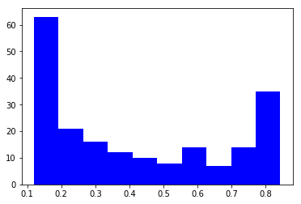
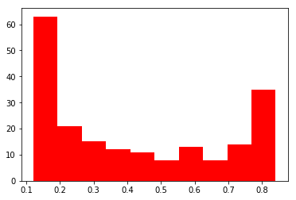
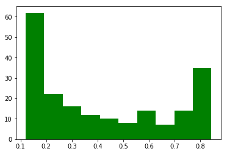
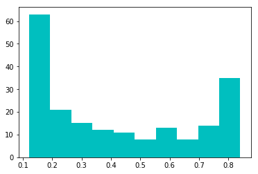

In this page we simulate data from a causal model in observational setting and examine the effect of omitted variables which stochastically predict the treatment assignment.

First import the necessary libraries:


```python
import numpy as np 

from utils import simulate_x, nonlinear, simulate_params

from sklearn.preprocessing import StandardScaler

import matplotlib.pyplot as plt

from simulate_data import SimulateNoIntraction
```


```python
n, p_c, p_iv, p_y, p_n = 200, 5, 5, 5, 5

True_TE = -1
```

Let's simulate data for inputs, exposure and output:


```python
y, A, x = SimulateNoIntraction(True_TE, n, p_c, p_iv, p_y, p_n, rho=.5, corr="AR(1)",
                                 nonlinearity_portion=.10, r1=.1, r2=1., sigma=1.)
```

Use inverse propensity score weighting for evalation of treatment effect:


```python
%%time
from rpy2.robjects.packages import importr
import rpy2.robjects as ro
import rpy2.robjects.numpy2ri
rpy2.robjects.numpy2ri.activate()

nr,nc = x.shape
x_r = ro.r.matrix(x, nrow=nr, ncol=nc)
```

    CPU times: user 532 ms, sys: 664 ms, total: 1.2 s
    Wall time: 300 ms


```python

_ = ro.r('A = c{}'.format(tuple(A.flatten())))

_ = ro.r('W = c{}'.format(tuple(x_r)))
_ = ro.r("W = matrix(W, nrow={}, ncol={})".format(nr, nc))

_ = ro.r('y = c{}'.format(tuple(y.flatten())))

```


```python
_ = ro.r('data_r = data.frame(cbind(A, W))')
```


```python
formula_x = ""
for a in ro.r('names(data_r)')[1:]:
    formula_x += "+" + a
```


```python
_ = importr("twang")
_ = ro.r('library("twang")')
```


```python
%%time
%%capture
ps_r_results = ro.r('ps_r <- ps(formula=A ~ {}, data=data_r, n.trees=200, shrinkage=.01, stop.method=c("es.mean", "es.max", "ks.mean", "ks.max"))'.format(formula_x[1:]));
```

    CPU times: user 26.1 s, sys: 39.2 ms, total: 26.1 s
    Wall time: 26.1 s


```python
colors = ["b", "r", 'g', 'c']

for j in range(4):
    temp_ps = np.array([a[j] for a in ro.r('ps_r$ps')])
    plt.hist(temp_ps, color=colors[j])
    plt.show()
```














If we run the code 
```
ro.r('ps_r$ps')
```
it will provide the propensity score corresponding to the stopping rules. Since the distribution of propensity scores for different stoping rules doesn't differ a lot, we will pick the ps corresponding to the first stopping rule:


```python
gbm_ps = np.array([a[0] for a in ro.r('ps_r$ps')])
```


```python
A1, A0 = gbm_ps, 1-gbm_ps
```


```python
w1, w0 = 1/A1, 1/A0
```


```python
mu1 = np.sum(y * A * w1)/np.sum(A * w1)
mu0 = np.sum(y * (1-A) * w0)/np.sum((1-A) * w0)
```


```python
TE_gbm_ps = mu1 - mu0
TE_gbm_ps
```


    -0.3340429363136383


